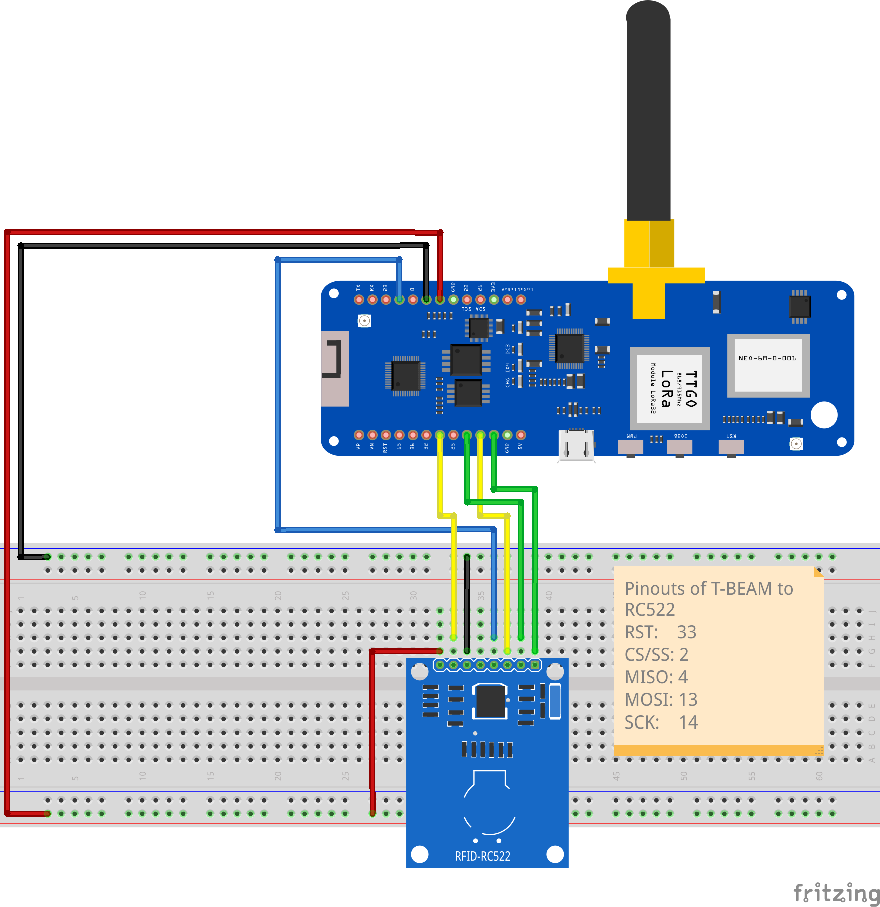

Introduction
============

TTGo T-Beam has a more resticten IO-lines available and memory. Due to its architecture.

Setup of the project
--------------------



Arduino-sketch
--------------

Using Arduino 2.0:

- Goto Files -> Preferences and fill into *Additional boards manager URLs*:
  ```
  https://raw.githubusercontent.com/espressif/arduino-esp32/gh-pages/package_esp32_index.json
  ```
- Goto *Tools -> Boards -> Board Manager...*. In the board manager search for ESP32 and install the latest version
- Goto *Tools -> Boards -> esp32*. Search and select T-Beam
- Goto *Tools -> Manage Libraries...*. Search MFRC522 library and install *MFRC522 by GithubCommunity*.

You can ofcourse upload the basic example, which reads out a RFID tag.

- Goto *Files -> Examples -> MFRC522* and select the DumpInfo() sketch

You need to adapt it to use the non-default SPI lines (SCK, MISO, MOSI, CS).

PlatformIO
----------

Using PlatformIO in VSCode. Start a new project using TTGO T-beam, Arduino platform.

- Goto Home of PlatformIO, New Project: 
  Name: TTGO-RC522
  Board: TTGO T-Beam
  Platform: Arduino
- Goto Home of PlatformIO, Select Libraries and search for MFRC522 
- Select the MFRC522
- Click the **Add to Project** button
- Select the project you want to add it to and press **OK**
- Copy/Past the DumpInfo example to test connectivity with RC522 board.

Now you can build it and test the RFID reader.

MicroPython
-----------

Install Micro Python on ESP32:

Follow the instrutcions from the MicroPython site as described on:
- https://docs.micropython.org/en/latest/esp32/tutorial/intro.html

You can just upload the micropython file to ESP-board using the build in terminal of PlatformIO.

Some links to help:
- https://docs.micropython.org/en/latest/esp32/quickref.html#webrepl-web-browser-interactive-prompt
- https://pythonforundergradengineers.com/how-to-install-micropython-on-an-esp32.html
- https://micropython.org/download/esp32/
- https://pythonforundergradengineers.com/upload-py-files-to-esp8266-running-micropython.html

In the platformIO-terminal, we will install ampy to run and upload python files to T-Beam board.

- https://www.digikey.be/en/maker/projects/micropython-basics-load-files-run-code/fb1fcedaf11e4547943abfdd8ad825ce

Do not open a serial terminal to your ESP32 when you use ampy, because it doesn't allow ampy to work.


To use the RC522:

- https://github.com/wendlers/micropython-mfrc522

Download the mfrc522.py and upload it to your T-Beam.

References:
-----------

- https://www.youtube.com/watch?v=fK4YQROD9Ps (overview of the board)
- https://www.youtube.com/watch?v=X63bKZInf_s (buttons)
- http://www.lilygo.cn/claprod_view.aspx?TypeId=62&Id=1281&FId=t28:62:28 (documentation)
- https://esp32io.com/tutorials/esp32-rfid-nfc
- https://espressif-docs.readthedocs-hosted.com/projects/arduino-esp32/en/latest/getting_started.html
- https://randomnerdtutorials.com/esp32-spi-communication-arduino/
- https://www.youtube.com/watch?v=ENMul9eAB00
- https://randomnerdtutorials.com/esp32-spi-communication-arduino/
- https://github.com/LilyGO/TTGO-T-Beam/issues/9
- https://www.hackster.io/news/the-ttgo-t-beam-an-esp32-lora-board-d44b08f18628

